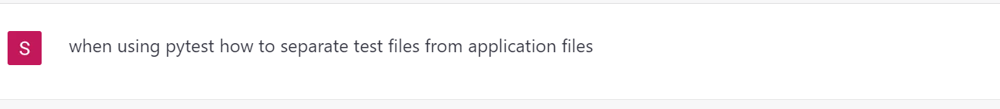

# learn-python

## Required software

1- Git which can be downloaded for Windows from [here](https://git-scm.com/downloads).
You only need Git if you are planning on committing your project into a Git repo.

2- VScode IDE with [Python externsion](https://marketplace.visualstudio.com/items?itemName=ms-python.python)

3- Pytest library which can be installed from the command line on Windows or Mac using pip3 package manager. After installing Pytest, type `pytest -h` on the command line to make sure it is working 

You might get a warning after installing pytest "WARNING: The scripts py.test.exe and pytest.exe are installed in 'C:\User........ bla bla bla"

You will need to add the directory where paytest installed into PATH on Window 10. To add a new path to Windows PATH, you can follow the instructions on [this page](https://www.architectryan.com/2018/03/17/add-to-the-path-on-windows-10/).

## Setup VS Code Workspace

Workspace is a container of files and one or multiple root folders with a configuration file called .code-workspace

Suppose we have a folder called "development" where we do all our coding. Inside development there is a folder called lean-python which is our weekly examples app. In VS Code open the folder "lean-python" then do 

file --> Save Workspace As 

And save the workspace file in the parent directory "development" not in lean-python. A file called learn-python.code-workspace will be saved in development. It is better to save the file outside the project code if we are going to use Git. This way it will not be committed to the repo because it is related to your setup environment.

When we start working with VS Code and there are no files open, go to:

file --> Open Workspace (from File menu) 

and navigate to learn-python.code-workspace to open.

## Create the App

When asked ChatGPT 

Her answer was

my_project/  
├── app/  
│   ├── \_\_init__.py  
│   ├── module1.py  
│   └── module2.py  
└── tests/  
    ├── \_\_init__.py  
    ├── test_module1.py  
    └── test_module2.py  

In this example, we have an app/ directory for our application code, and a tests/ directory for our test code. Each test file (test_module1.py and test_module2.py) corresponds to a module in our app/ directory (module1.py and module2.py, respectively). 

By default, pytest will also discover and run any test functions that are defined in files with names that start with test_, so it's a good convention to use when naming your test files.

I noticed a file called \_\_init__.py" in each folder, I asked chatGPT again

And this was the answer

*In Python, \_\_init__.py files are used to mark a directory as a Python package. When the Python interpreter encounters a directory that contains an \_\_init__.py file, it treats the directory as a package and allows you to import modules from it using Python's import statement.*

In our app we will not need to import modules so we will just create an empty \_\_init__.py in each folder for now.

So let's start the project creating the following structure

learn-python/  
├── app/  
│   ├── \_\_init__.py  
│   ├── week0/  
│   │   ├── \_\_init__.py  
│   │   ├── hello.py  
│   │   ├── person.py  
│   └── week1/   
└── tests/  
    ├── \_\_init__.py  
    ├── week0  
    │   ├── \_\_init__.py  
    │   ├── test_hello.py  
    │   ├── test_person.py  
    └── week1  

Or just use Git to either fork the project from my account to your account or clone the repo into your local machine. And just to explain if you are not familiar with Git, "Fork" will create a snapshot of the project in your Git account. After you fork the code, any future updates I push to my code will not be copied to your copy. Cloning is the same but instead it will create a copy or snapshot of the project in your local machine.

If you decided to create all the directories and files from scratch, use VS Code to do that rather than creating, renaming or moving files using Windows file explore  

It is good practice when we use __Workspace__ to use VS Code to handle file operations in our project.

## Week 0
The purpose of week0 code is to play with *pytest* before we do the actual excercise. 

### hello.py

This module has 2 simple functions __add_numbers__ and __multiply_numbers__. In order to  

To run our code inside VS Code, we need to make Python 3 as the default interpreter in VS Code. To do that I asked __chatGPT__ on how to do that, and her answer was:
<i>
Open your project in VS Code.

Click on the "View" menu in the top menu bar, then select "Command Palette" (or press Ctrl+Shift+P on Windows or Cmd+Shift+P on macOS).

In the search bar of the Command Palette, type "Python: Select Interpreter" and select the command with the same name.

A list of available interpreters will be shown. If Python 3 is not listed, you may need to install it first. Select "Python 3" from the list.

Once you have selected Python 3, Visual Studio Code will save this setting for future use.

You can confirm that Python 3 is now the default interpreter by opening a Python file and checking that the Python version displayed in the status bar at the bottom of the screen is Python 3.
</i>

Once we define which compiler to use, run the code by clicking on the __Run__ button 

and you can see the result in the TERMINAL window:

Now we write person.py to demonstrate how to write a simple Person class with constructor and a function called *get_full_name* to return full name. Run the code and make sure to look in the TERMINAL window in VS Code to see the result.

## Writing the test units
Now we are going to write test units for both hello.py and person.py.

Create 2 files one is test_hello.py and test_person.py under tests/week0 folder. Make sure to use VS Code to create the folder and files. Make sure to have \_\_init.py__ file in the new folders created.

We need to import pytest to make *assert* function available. In Python, the assert function is used for debugging and testing purposes. Then we need to access our code in hello.py in order to test. So we import hello.py by this import statement:

`
import app.week0.hello as hello
`
Now we have access to all functions in hello.py. First function is *add_numbers*. The convention is to write a test function with the name test_add_numbers(). Basically the test is:

`
assert expression1 == expression2, error_message
`

In our case:

`
assert hello.add_numbers(2, 3) == 5, "result must equal 5"
`

We write as much test cases as required for both modules hello.py and person.py.

## Run the Tests
Once we finished with writing the test cases, now it is time to run the test cases and see if they're successful or not.

In order to do testing in VS Code we need first to configure the test environment. To do that, click on the test icon in VS Code  and then click on Confiure Python Tests button

VS Code will ask you to select the test framework you're going to work with. In our case we're using pytest. So we select it:

Then it will prompt you to choose your test folder:

You can chooe the root or tests. In this case I chose root folder.

Once you choose the dir, a little circle will appear next to the root and the test folders:

You can then run the tests by clicking on the run icon next to the file test_hello.py (which runs all test functions in this file) or just run one unit by clicking on the run button next to test_add_numbers function.

Once we configure the test, VS Code creates a folder called .vscode and a json file called settings.json with our testing environment configurations:

When clicking on Run icon to run the test, a spinner will show up to indicate the test is running:

Then a green tick will show next to each successful test:

And when tests fail, it will show a red cross icon next to each unsuccessful case:

## Testing print("Hello World!")

Create a new file app\week1\exercise0.py which has only one function:

`
def print_hello_world():
    print("Hello, world!")
`
Create a file tests\week1\test_exercise0.py which has the test code.

`
assert captured.out == "hello world\n"
`
Now run the test and see result.

the - sign is what we provide

the + sign is what's expected

In this case, we provide "hello world\n" in the assert statement, while the real function prints "Hello, world!". We fix the assert statement:

`
  assert captured.out == "Hello, world!\n"
`
And run the test again. We should get green ticks now.

## How to Git in VS Code

To use Git inside VS Code, click on the source control icon (third):

A number shows how many changes need to be committed. The changes could be adding new file, updating existing file, deleting or renaming.

We have the option to commit individual files or folders or commit the entire app. Each file/folder that needs to be committed has a + sign next to it. To commit everything just click on the + on top of all the files (see picture above).

Clicking the + sign will just add the changes to the local repo.
Next, type a proper comment in the message box and click "Commit" button. This will stage changes locally only.

Next click "Sync Changes" to commit to the remote repo:

## Useful Links
[Generating a new SSH key and adding it to the ssh-agent](https://docs.github.com/en/authentication/connecting-to-github-with-ssh/generating-a-new-ssh-key-and-adding-it-to-the-ssh-agent)

[Adding a new SSH key to your GitHub account](https://docs.github.com/en/authentication/connecting-to-github-with-ssh/adding-a-new-ssh-key-to-your-github-account)

